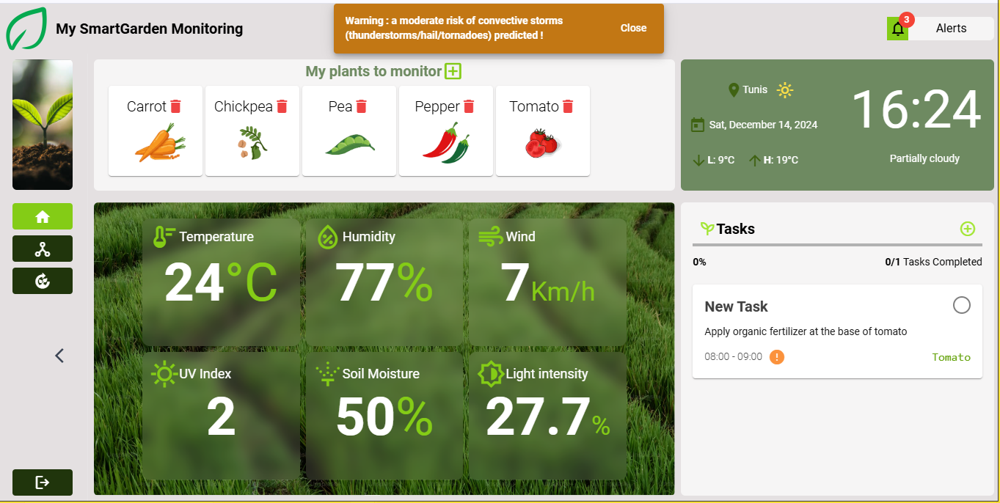
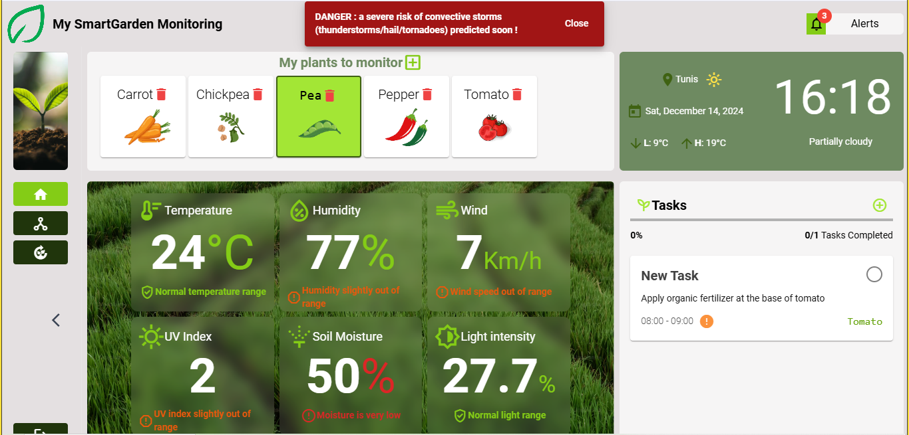

# ✨ IoT Project with Angular 13, Flask, MQTT, and ML/DL Algorithms

See the app demo ? Consult this link : https://drive.google.com/file/d/1Utyq1ixwL_11p-BXn7cv6J7kePKY8KZW/view?usp=drive_link

Note : To be able to to extract : wind speed, lowest and highest temperature of the day, UV index, you should create an account at :  # weather.visualcrossing.com
And use your own key : 
```bash
private weatherUrl = "https://weather.visualcrossing.com/VisualCrossingWebServices/rest/services/timeline/YOURCITY?key=YOURKEY";
```

## Table of Contents
1. [Project Overview](#project-overview)
2. [Technology Stack](#technology-stack)
3. [Features](#features)
4. [Architecture](#architecture)
5. [Installation and Setup](#installation-and-setup)
6. [Project Structure](#project-structure)
7. [Usage](#usage)
8. [MQTT Configuration](#mqtt-configuration)
9. [ML/DL Algorithms](#ml-dl-algorithms)
10. [API Endpoints](#api-endpoints)
11. [Testing](#testing)
12. [Contributing](#contributing)
13. [License](#license)

---

## Project Overview
This project is an IoT-based system that integrates real-time sensor data, machine learning, and deep learning algorithms. The front end is developed using **Angular 13**, while the backend uses **Flask**. Communication between IoT devices and the server happens via the **MQTT protocol**. Data processing and analysis leverage **ML/DL algorithms** to deliver intelligent insights.

### Key Goals
- Real-time sensor data collection and visualization.
- Efficient communication using MQTT.
- Backend support for data processing and machine learning.
- Web-based interface for data interaction and insights visualization.

---

### Key App functionalities
- Get sensors and external api data and inform farmer of the potential risks for the plant.
- Managing list of plants.
- Managing daily tasks.
- Inform farmer of possible storm for the next hour to come.
- Managing logs.
- Predicting health of plant.

---

## Technology Stack
### Frontend
- **Framework**: Angular 13
- **UI Library**: Angular Material / TailWind

### Backend
- **Web Framework**: Flask
- **Protocol**: MQTT (via `paho-mqtt` library)
- **Data Processing**: Pandas, NumPy
- **ML/DL**: Scikit-learn, TensorFlow/Keras
- **Database**: MYSQL 

### IoT Communication
- **Protocol**: MQTT
- **MQTT Configuration**: HiveMQ broker

---

## Features
- Real-time sensor data acquisition via MQTT.
- Dynamic dashboards to visualize sensor data.
- Machine learning models to process and analyze incoming data.
- RESTful APIs for backend communication and plant/tasks management
- Notifications/alerts based on intelligent thresholds.
- Deep learning algorithms for anomaly detection or prediction.

---

When a moderate risk of storm is predicted : 


When a moderate risk of storm is predicted : 


## Architecture
```
                +-------------------------------+
                |       IoT Devices            |
                |    (Sensors/Actuators)       |
                +---------------+---------------+
                                |
                                | MQTT
                                v
                +-------------------------------+
                |           Flask Backend       |
                |  - MQTT Broker Integration   |
                |  - Data Preprocessing        |
                |  - ML/DL Processing          |
                +---------------+---------------+
                                |
                                | REST APIs
                                v
                +-------------------------------+
                |         Angular Frontend      |
                |  - Real-time Dashboards      |
                |  - Visualizations/Controls   |
                +-------------------------------+
```

---

## Installation and Setup

### Prerequisites
Ensure the following tools are installed on your system:
- Node.js (v14+)
- Angular CLI (v13)
- Python (v3.8+)
- MQTT Broker (e.g., HiveMQ)
- Virtualenv (recommended for Python)

### Frontend Setup (Angular)
```bash
# Clone the repository
git clone https://github.com/Sabermahjoub/SmartGarden.git
cd SmartGarden/Smart-Garden-front

# Install dependencies
npm install

# Start the development server
ng serve

# Open http://localhost:4200 in your browser
```

### Backend Setup (Flask)
```bash
# Navigate to the backend folder
cd ../backend

# Start the Flask server
python app.py

# API will be available at http://127.0.0.1:5000
```

### MQTT Broker Setup
1. Install **HiveMQ** MQTT broker.
2. Start the HiveMQ server with the default configuration.
3. Use the broker's URL (e.g., `mqtt://localhost`) for testing.

---

## Project Structure
```plaintext
SmartGarden/
├── Smart-Garden-front/      # Angular 13 Frontend
│   ├── src/
│   ├── angular.json
│   └── package.json
│
├── backend/                 # Flask Backend
│   ├── DL__ClassificationImage.ipynb   # DL model
│   ├── PlantVillage/   # DL classification dataset
│   ├── ML_prediction.ipynb             # ML model
│   ├── plant_growth_data.csv           # ML dataset
│   ├── background_job.py       # MQTT configuration
│   ├── smartgarden.sql       # DB configuration
│   ├── esp32.py       # hardware configuration
│   ├── app.py               # Main Flask application
│
└── README.md                # Project documentation
```

---

## Usage
1. Start the **MQTT broker**.
2. Run the Flask server to process incoming data and serve APIs.
3. Launch the Angular frontend for real-time data visualization.

---

## MQTT Configuration
- **Broker URL**: `mqtt://localhost` (or your MQTT server address)
## Dependencies
Flask and MQTT library for connecting with the broker and subscribing to messages
```bash
   pip install Flask paho-mqtt
```

Example MQTT Message Format:
```json
{
  "temperature": 25.3,
  "humidity": 60,
  "moisture": 40, //soil moisture
  "light_intensity": 50,
  "timestamp": "2024-12-14:00:00Z"
}
```

---

## ML/DL Algorithms
This project incorporates the following machine learning and deep learning algorithms:
1. **Regression**: For predictive analysis based on sensor data and external api data.
3. **Classification Model**: For predicting health of a plant based on its leaf.

Pre-trained models are stored in the `backend/` directory and loaded during runtime.


---

## Testing
### Frontend Testing
```bash
# Run unit tests
ng test

# Run end-to-end tests
ng e2e
```

### Backend Testing
```bash
# Run Flask unit tests
pytest
```

---

## Contributing
Contributions are welcome! Follow these steps:
1. Fork the repository.
2. Create a new branch: `git checkout -b feature/your-feature`.
3. Commit your changes: `git commit -m 'Add feature XYZ'`.
4. Push to the branch: `git push origin feature/your-feature`.
5. Submit a pull request.

---

## License
This project is licensed under the MIT License. See the LICENSE file for more details.

